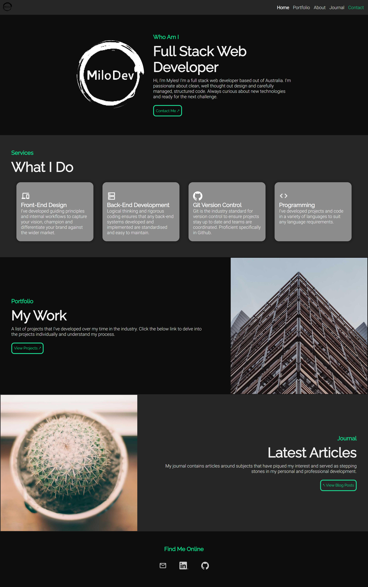
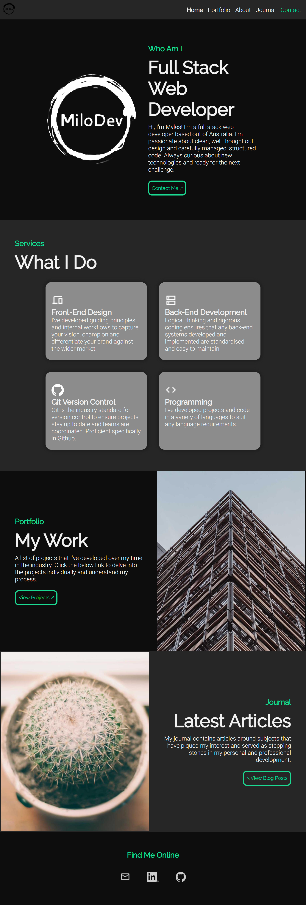
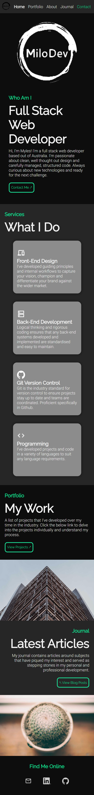
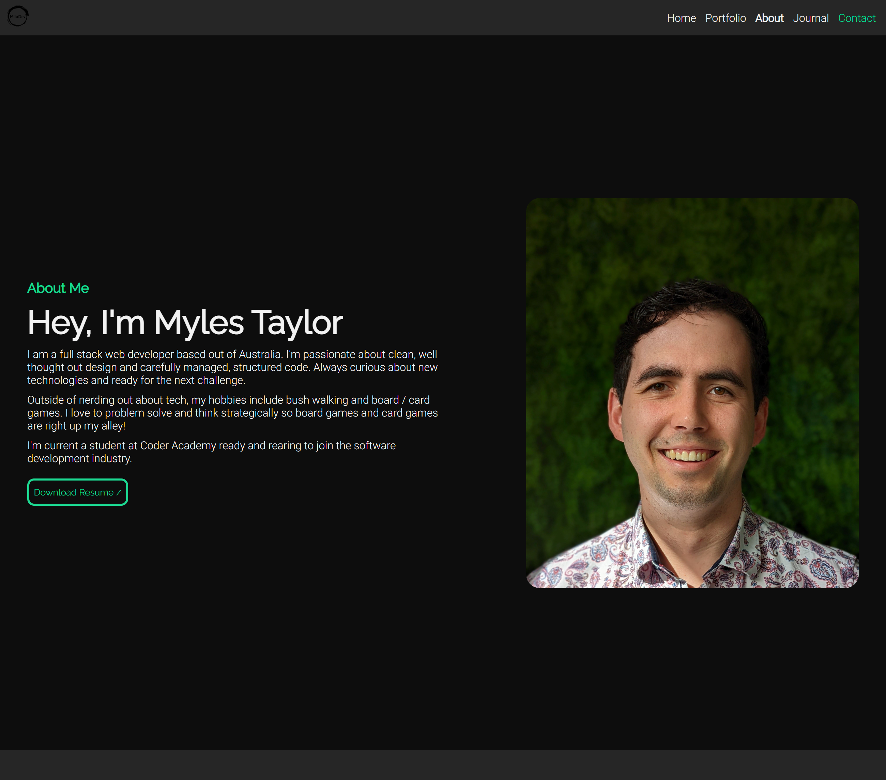
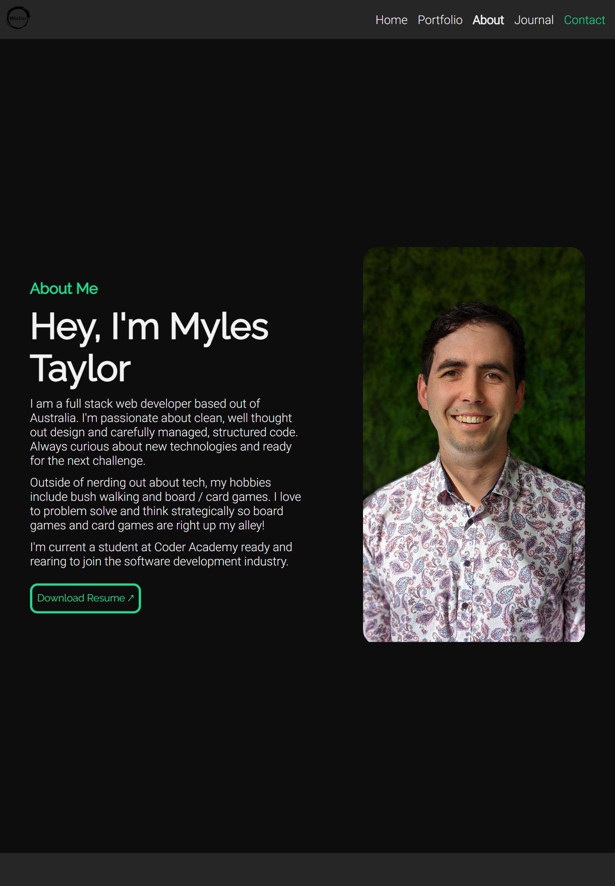
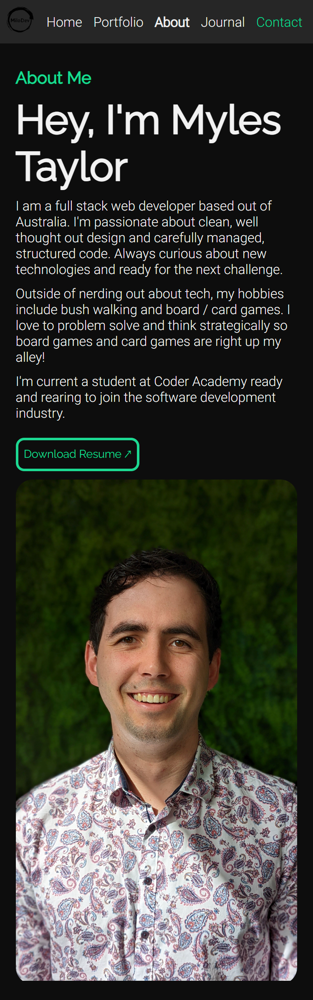
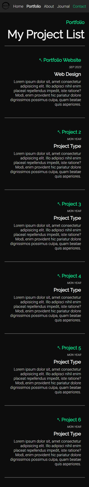
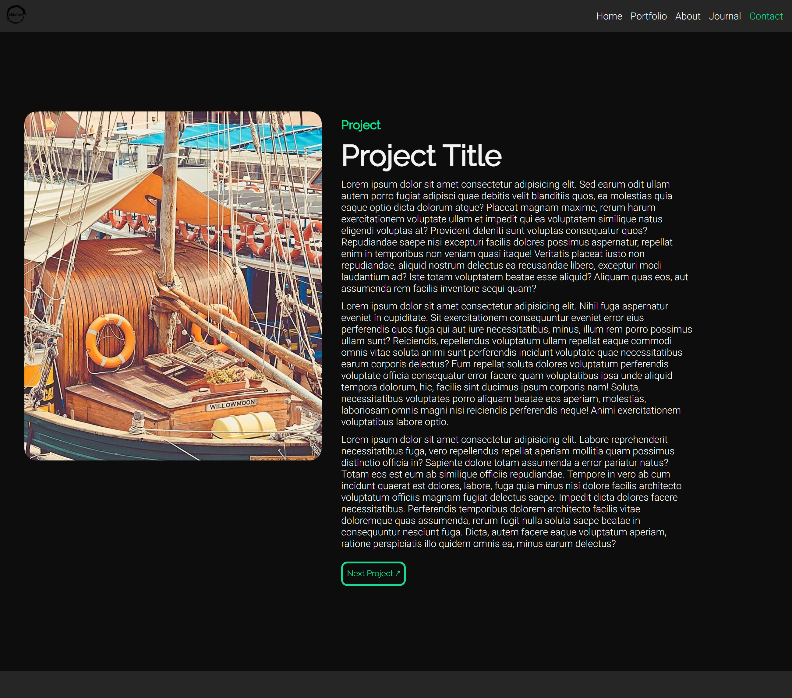
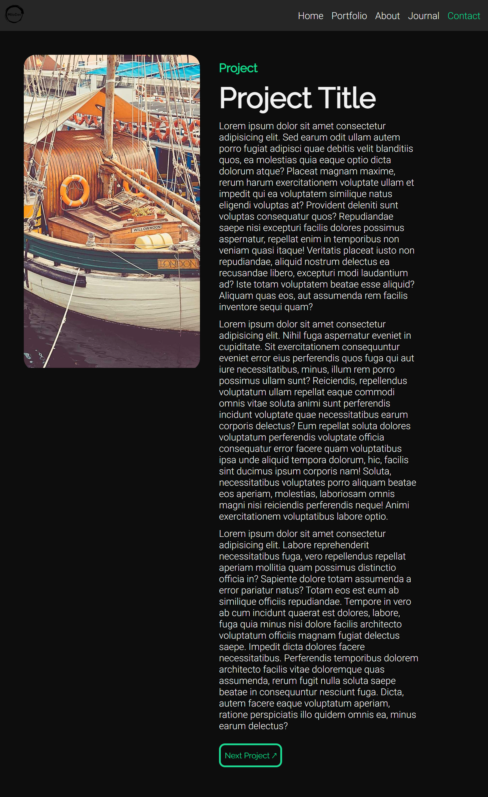

# T1A2 - Portfolio Site

[Published Portfolio Site](https://portfolio-site-nine-dusky.vercel.app/)  
[Github Repository](https://github.com/MiloMT/portfolioSite)  
[Presentation](https://youtu.be/iyYQi4f3iq8)

## Purpose

The purpose of this site is to provide an avenue to market myself as both a developer and IT professional to external parties. The site contains information about myself, my work and how to get into contact with me, aswell as displaying a personalised yet professional aesthetic to viewers.

## Functionality / Features

The website is designed responsively to handle a variety of device sizes up to a maximum of 1280px wide.

Semantic tags are used throughout to add meaning to the various document components and to cater for accessibility when the site is traversed via a variety of means. Careful thought has also been given to the color scheme to ensure that there is a high level of clarify for the content on the page.

The preferred methodology for layout and organisation throughout the site has been flexbox. Nested flexboxes are used extensively throughout in order to manage the content desirably across a variety of screen sizes as mentioned above.

The main host pages in the site are:

- Home Page
- About / Resume
- Portfolio
  - Project Pages
- Blog Home Page
  - Blog Pages
 
In order to account for the variety of pages, a single SCSS/CSS document has been developed as a custom framework for all the pages. The largest components contained within the SCSS/CSS document are:

- Section Containers: These containers highlighted with dark and lighter backgrounds act as the central containers for the page content and make it easier for the user to navigate throughout the site. Really differentiates the different sections and site information.
- Navbar: Very simple and easy Nav bar located at the top of every page. Top left contains a logo and top right has links to other major pages in text rather than iconography for clarify purposes.
- Cards: There are a variety of cards including contact cards and services cards, each with a corresponding picture and description. These cards are created in a way so that they're easy to manage and maintain further down the track. They also auto arrange themselves regardless of size or number for responsive design.
- Feature images: On the home site and than also on the other pages too, there are a variety of feature image containers to grab interest and react to the responsive design of the site. Never overwhelming the other content.
- Project List: A straight forward and easy to browse list of current projects, link to project pages, and categories to entice users in and provide immediate information on the individual projects.
- Blog / Project Post pages: Simple and easy to maintain pages that contain a feature image and content in a way that adjusts responsively to screen size.

## Sitemap

*Note that the Github Project Link and Contact Forms are not operational - JS required for popup form and project links added as needed*

## Wireframes

*Contact Buttons not functional throughout - JS needed for popup forms and tracking*  

*Home Page*  

*Resume*  

*Portfolio - Project Image non functional, JS needed for hover different project anchors to change image*  

*Blog Home*  

*Project / Blog Page*  

## Screenshots

### Home Page
| *Desktop* | *Tablet* | *Phone* |
|---|---|---|
|  |  |  |

### About
| *Desktop* | *Tablet* | *Phone* |
|---|---|---|
|  |  |  | 

### Portfolio
| *Desktop* | *Tablet* | *Phone* |
|---|---|---|
|  |  |  | 

### Blog
| *Desktop* | *Tablet* | *Phone* |
|---|---|---|
|  |  |  | 

### Post
| *Desktop* | *Tablet* | *Phone* |
|---|---|---|
|  |  |  | 

## Target Audience

This website is targeted towards a few types of individuals:
- Potential Employers
- Other Industry Professionals
- Myself as a personal development tool and testing ground

## Tech Stack

- Slide Deck: Google Slides
- Wireframes and Site Map: Figma
- Website: HTML & CSS/SCSS
- Deployment: Vercel
